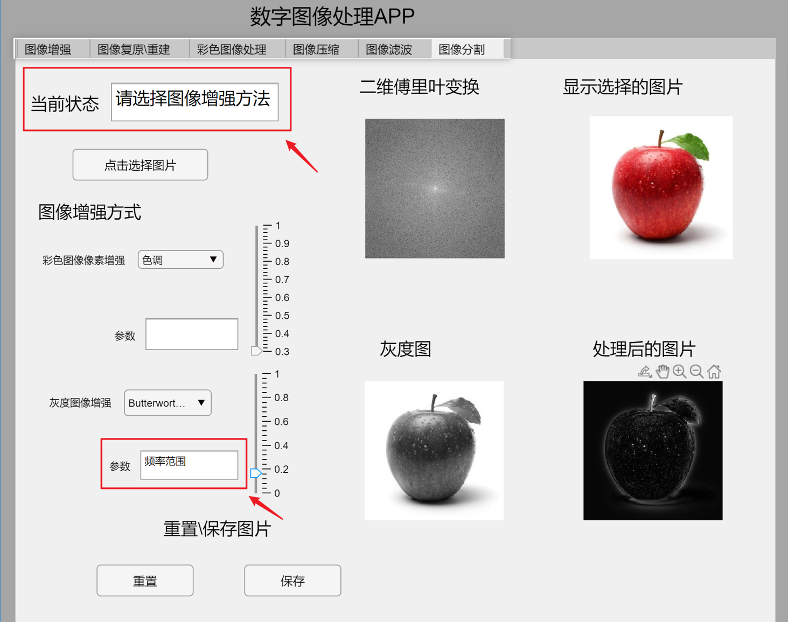

# 图像处理应用+UI界面

C_N_U IE的数字图像处理课程期末作业，使用matlab开发了一款数字图像处理的应用，带着UI界面。

C_N_U IE's final assignment for the Digital Image Processing course, developed an application for digital image processing using matlab with a UI interface.

<!-- PROJECT LOGO -->
 

  

  <h3 align="center">图像处理应用+UI界面</h3>
  

本应用是一款功能丰富的图像处理软件，旨在通过各种图像处理技术来达到用户所需的效果。应用涵盖了图像增强、图像复原/重建、彩色图像处理以及图像压缩等四大类图像处理方法。以下是本应用的详细功能介绍：
### 使用
需要安装MATLAB。

## 功能列表

### 1. 实现功能
#### 1.1 特殊滤镜
- **Posterize（海报化）滤镜**
- **浮雕滤波**
- **Sepia滤镜**
- **锐化滤波**
- **卡通滤镜（Cartoon Filter）**
- **Vignette（晕影）滤镜**

#### 1.2 边缘检测
- **Sobel滤波**
- **普雷维特滤波**
- **Roberts滤波**
- **LOG滤波**
- **Canny算子**

#### 1.3 色彩变换
- **Negative Filter**
- **Solarize Filter（曝光反转）**

#### 1.4 边缘检测
- **Sobel算子**
- **Canny算子**

#### 1.5 分割方法
- **基于区域的分割**

### 2. 彩色图像像素增强
- **色调**
- **饱和度**
- **亮度**
- **对比度**

### 3. 灰度图像增强
- **灰度变换**
- **直方图均衡化**
- **矩形平均滤波**
- **圆形平均滤波**
- **高斯滤波**
- **中值滤波**
- **理性低通滤波**
- **Butterworth低通滤波器**
- **高斯低通滤波器**
- **理性高通滤波器**
- **Butterworth高通滤波器**
- **高斯高通滤波器**

### 4. 选择图像污染模型
- **盐噪声**
- **椒盐噪声**
- **高斯噪声**
- **斑点噪声**
- **泊松噪声**
- **运动模糊**
- **大气湍流模型**
- **运动模糊加性高斯噪声**

### 5. 选择去噪方式
- **中值滤波器**
- **均值滤波器**
- **维纳滤波器**
- **维纳逆滤波**

### 6. 彩色图像转换
- **灰度图像**
- **索引图像**
- **HIS图像**
- **RGB分量平滑**
- **HIS强度分量平滑**

### 7. 灰度到彩色的转换
- **强度分层**
- **传递函数**

### 8. 图像压缩
- **霍夫曼编码**
- **预测编码**
- **奇异值分解**

、、

## 作者

LLIKKE

